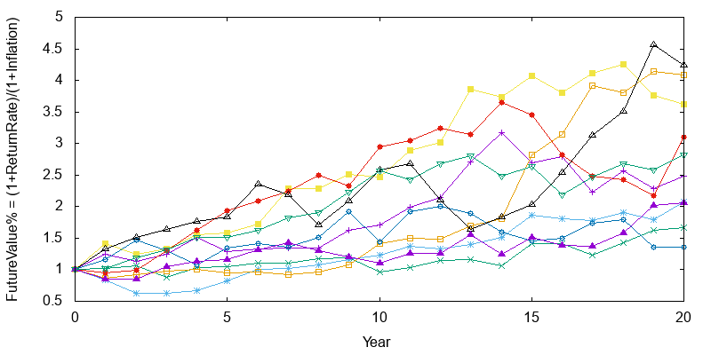
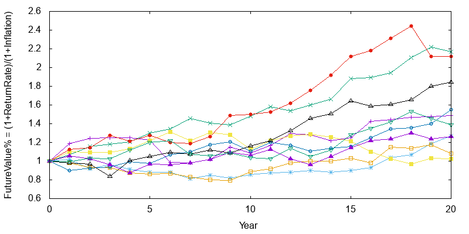

## Overview

Monte Carlo method is one that uses repeated sampling to predict a result.

Monte Carlo methods vary, but tend to follow a particular pattern:

* Define a domain of possible inputs
* Generate inputs randomly from a probability distribution over the domain
* Perforce a deterministic computation on the inputs
* Aggregate the results

### Value at Risk (VaR)

VaR is a simple measure of an investment's risk that tries to provide a reasonable estimate of 
maximum probable loss over a particular time period.
 
A VaR statistic depends on 3 parameters:

* A portfolio
* A time period
* A confidence level

A VaR of 1 million dollars with a 95% confidence level and two weeks indicates the belief that the
portfolio stands only 5% changed of losing more that a million dollars over two weeks.

A few different methods are employed to calculate VaR:

* Variance-covariance: TBD 
* Historical simulation: This tries to directly extrapolate risk from historical data. A drawback
of this method is that historical data can be limited and failes to include 'what-ifs', which may need 
introduce 'shocks' to simulate collapse situation.
* Monte Carlo simulation: 
  * Defines a relationship between market conditions and each instruments' returns
  * Poses "trials" consisting of random market conditions
  * Calculates the portfolio loss for each trial, and uses the aggregated trial data to build up a 
    profile of the portfolios risk characteristics.

## Problem

 

Modern Portfolio Theory says that it is not enough to look at the expected risk and return of one 
particular stock. By investing in more than one stock, an investor can reap the benefits of 
diversification- chief among them, a reduction in the riskiness of the portfolio.
 
A Real Time implementation of Modern Portfolio Theory is to build an optimal asset allocation of
domestic stocks & bonds, international stock and bonds, alternatives and cash. Combining the risk & 
return of each asset class and correlations across them – we come up with the risk and return of 
the overall portfolio.  

Two portfolios were created, one being extremely Conservative and one being Aggressive.

|Portfolio Type| Return (Mean) | Risk ( Standard Deviation)|
|:-------------|:--------------|:--------------------------|
|Aggressive|%9.4324|%15.675|
|Very Conservative|%6.189|%6.3438|
 
We would now like to compare their performance against each other. We would like to know that if 
a user with $100,000 invested their money in either of them, how would the returns compare over the 
next 20 years. We would like to test their performance by using forward-looking Monte Carlo Simulations.
 
#### Monte Carlo Simulation:

This is a statistical technique that uses pseudo-random uniform variables for a given statistical 
distribution based on past risk (SD) and return (mean) to predict outcomes over future time periods. 
Based on iterative evaluation of each random future value, we project the portfolio future value 
over 20 years. We would like to run 10,000 simulations of projecting 20 year value and come up with 
the following:
 
##### Assumptions

1. We would like to use a random number generator to ensure Gaussian distribution of random numbers 
   that are generated. 
2. 20th Year future value should be inflation adjusted at the rate of 3.5% each year. Ie. Year 1 
   value of 103.5 is equivalent to 100 at Year 0.
 

##### Solution Needed
 
Portfolio Inflation Adjusted Values from Simulation
 
| Portfolio Type | Median 20th Year | 10 % Best Case |10 % Worst Case |
|:---------------|:-----------------|:---------------|:---------------|
|A - Aggressive |3.0354|5.6589|1.0468|
|I - Very Conservative|1.6711|2.2679|1.1431|
 
 
Description

* 10% Best Case:   90th Percentile value among the 10,000 simulations
* 10% Worst Case:  10th Percentile value among the 10,000 simulations.

 
## Reference
* [Monte Carlo Simulation for Stocks: A Predictive Analytics Example By Apache Spark](https://www.linkedin.com/pulse/monte-carlo-simulation-stocks-predictive-analytics-debajani)
* [Estimating Financial Risk with Apache Spark](http://blog.cloudera.com/blog/2014/07/estimating-financial-risk-with-apache-spark/)
* [Portfolio Risk Management & Analysis With Monte Carlo Simulations](https://www.capitalspectator.com/portfolio-risk-management-analysis-with-monte-carlo-simulations/)
* [GnuPlot example](https://alvinalexander.com/technology/gnuplot-charts-graphs-examples)